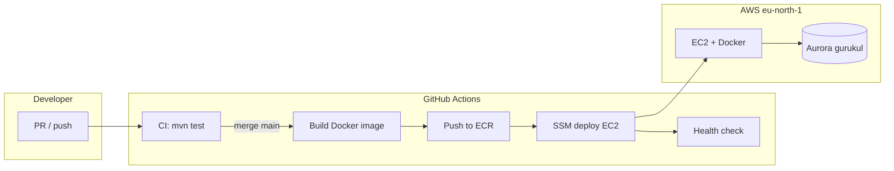

# Gurukul — Streamlined Deployment Pipeline

Target: **push to `main` → test → build JAR → S3 → SSM → EC2 → health check**, with no manual SSH for routine deploys.

Repo: https://github.com/vabsgoyal/Gurukul_bk

---

## Current state

| Stage | Today |
|-------|--------|
| Source | GitHub `main` |
| CI | `mvn test` on push/PR (`.github/workflows/ci.yml`) |
| Build | GitHub Actions `mvn package` → S3 |
| Deploy | SSM → `/opt/gurukul/deploy-from-s3.sh` on EC2 |
| Database | Aurora IAM — Flyway on app startup |
| Secrets | Env file on EC2 — no DB password |

---

## Recommended target pipeline



```text
┌─────────────┐     PR      ┌──────────────┐
│  Developer  │ ──────────► │  CI (test)   │
└─────────────┘             └──────────────┘
       │ merge main
       ▼
┌──────────────────────────────────────────┐
│  CD: build JAR → upload S3 → SSM → EC2 restart │
└──────────────────────────────────────────┘
       │
       ▼
  /actuator/health  (smoke test)
```

**Principles**

1. **Build once** in CI — never `docker build` on EC2 in production.
2. **Immutable tags** — every deploy uses `ECR_URI:git-sha`; `:latest` for convenience.
3. **No SSH keys in GitHub** — use **SSM Run Command** (EC2 already has SSM agent on Amazon Linux).
4. **No long-lived AWS keys in GitHub** (Phase 2) — use **GitHub OIDC** → IAM role.
5. **Flyway stays in the app** — migrations run on container start; no separate migration job yet.
6. **Config on EC2** — `/etc/gurukul/backend.env` holds Aurora URL + `GURUKUL_IMAGE`; not in the image.

---

## AWS resources (one-time setup)

| Resource | Purpose |
|----------|---------|
| **ECR** `gurukul-backend` | Store Docker images |
| **EC2** `gurukul-backend` | Run container (IAM instance profile) |
| **IAM `GurukulEc2Role`** | `rds-db:connect` + `ecr:Pull` + `SSM` |
| **IAM `GurukulGitHubDeployRole`** | ECR push + SSM send-command (CI only) |
| **GitHub OIDC provider** | Trust GitHub Actions without access keys |

### EC2 instance profile policies

| Policy | Why |
|--------|-----|
| `rds-db:connect` (inline) | Aurora IAM auth |
| `AmazonEC2ContainerRegistryReadOnly` | Pull from ECR |
| `AmazonSSMManagedInstanceCore` | SSM deploy, no SSH |

### GitHub deploy role policies

| Policy | Why |
|--------|-----|
| `ecr:GetAuthorizationToken` + push to `gurukul-backend` | Push image |
| `ssm:SendCommand` on EC2 instance | Run deploy script |
| `iam:PassRole` | only if needed |

---

## GitHub Actions workflows

| Workflow | Trigger | Job |
|----------|---------|-----|
| **`ci.yml`** | PR + push | `mvn test`, optional `docker build` dry-run |
| **`deploy.yml`** | push `main`, `workflow_dispatch` | test → build → ECR push → SSM deploy → smoke test |

Files live in `.github/workflows/`.

### Required GitHub secrets (Phase 1 — access keys)

| Secret | Example |
|--------|---------|
| `AWS_ACCESS_KEY_ID` | deploy user |
| `AWS_SECRET_ACCESS_KEY` | deploy user |
| `AWS_REGION` | `eu-north-1` |
| `ECR_REPOSITORY` | `gurukul-backend` |
| `EC2_INSTANCE_ID` | `i-0abc123...` |
| `HEALTH_CHECK_URL` | `http://EC2_IP:8080/actuator/health` |

### Phase 2 — OIDC (recommended)

Replace access keys with:

```yaml
permissions:
  id-token: write
  contents: read

- uses: aws-actions/configure-aws-credentials@v4
  with:
    role-to-assume: arn:aws:iam::916169432799:role/GurukulGitHubDeployRole
    aws-region: eu-north-1
```

[AWS docs: GitHub OIDC](https://docs.github.com/en/actions/security-for-github-actions/security-hardening-your-deployments/configuring-openid-connect-in-amazon-web-services)

---

## EC2 runtime layout

```text
/etc/gurukul/backend.env     # SPRING_*, AWS_REGION, GURUKUL_IMAGE
/opt/gurukul/run-container.sh
/etc/systemd/system/gurukul-backend.service
```

Deploy script on EC2 (called by SSM from GitHub):

```bash
/opt/gurukul/run-container.sh pull-and-restart
```

---

## Environments (later)

| Env | Branch | EC2 | Aurora |
|-----|--------|-----|--------|
| **staging** | `develop` | `gurukul-staging` | same cluster or separate |
| **production** | `main` | `gurukul-backend` | `gurukul` |

Start with **one EC2 + one branch (`main`)**; add staging when you have real users.

---

## Flyway / migrations

| Approach | When |
|----------|------|
| **App startup (current)** | ✅ fine until multiple app instances |
| **Dedicated migration job** | When you run 2+ EC2/ECS tasks (run Flyway once per deploy) |
| **Manual `flyway migrate`** | Emergency only |

Rule: **never edit applied migrations** — only add `V2__`, `V3__`, etc.

---

## Rollback

```bash
# On EC2 or via SSM — set previous image tag in backend.env
GURUKUL_IMAGE=916169432799.dkr.ecr.eu-north-1.amazonaws.com/gurukul-backend:abc1234
/opt/gurukul/run-container.sh pull-and-restart
```

Or re-run GitHub Actions **`deploy.yml`** → **Run workflow** on an older commit.

---

## Monitoring (minimal)

| Layer | Tool |
|-------|------|
| App health | GitHub smoke test + `/actuator/health` |
| Logs | `journalctl -u gurukul-backend`, `docker logs` |
| EC2 | CloudWatch agent (optional) |
| Alarms | CloudWatch alarm if health check fails (optional) |

---

## Implementation phases

### Phase 1 — This week (MVP)

- [x] CI: `mvn test` on PR
- [ ] Create ECR repository
- [ ] EC2 with instance profile (RDS + ECR pull + SSM)
- [ ] Install `run-container.sh` + systemd on EC2
- [ ] GitHub `deploy.yml` with AWS secrets
- [ ] First automated deploy on merge to `main`

### Phase 2 — Hardening

- [ ] GitHub OIDC instead of access keys
- [ ] HTTPS (nginx + ACM or ALB)
- [ ] Restrict SG: close 8080 to public; only 443 via nginx
- [ ] JWT auth before real schools

### Phase 3 — Scale

- [ ] Staging environment
- [ ] ECS/App Runner if EC2 is not enough
- [ ] Separate Flyway migration step
- [ ] Slack/email on deploy failure

---

## Day-to-day developer flow

```text
1. Feature branch → PR
2. CI passes (tests)
3. Merge to main
4. deploy.yml runs (~5–8 min)
5. Verify HEALTH_CHECK_URL or curl EC2
```

No SSH required for normal releases.

---

## Related docs

- [EC2.md](./EC2.md) — first-time EC2 setup
- [DEPLOYMENT.md](./DEPLOYMENT.md) — App Runner / ECS alternatives
- [readme_run.md](../../readme_run.md) — local vs prod run commands
