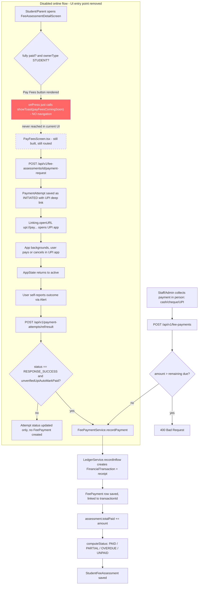

# Fee Payment Recording & the (Disabled) Online Payment Attempt — Flow

## Overview
Gurukul supports recording fee payments that staff already collected in person (cash/cheque/UPI reference entered manually), which updates a `StudentFeeAssessment`'s paid amount and status and posts an entry to the general ledger. A second, fully-built subsystem also exists for a student/parent to pay online via a UPI deep link (`PaymentAttempt` entity with its own status machine), but its only UI entry point in the app has been deliberately disabled — the button now shows a "coming soon" toast instead of navigating to the real payment screen — because the flow is a raw UPI deep link with no real payment gateway behind it, so a "success" is only ever the UPI app's own unverified claim. Both the manual-recording backend endpoint and the online-payment backend endpoints/UI screen remain in the codebase and fully functional in isolation; only the online flow's UI trigger is cut off.

## Actors / roles
- **ADMIN**: Configures the school's bank account / UPI VPA in Fee Payment Settings; can record payments and view/generate assessments for any student in the school.
- **TEACHER**: Can view fee status for the class-section(s) they are class teacher of (`GET /api/v1/class-sections/{id}/fee-status`); not specifically restricted from the payment-recording endpoints at the HTTP layer (see Known limitations).
- **STUDENT**: Can only create a payment request / record a payment / view attempts for their **own** assessment (enforced in `FeePaymentService.assertCanPayOrRecord`); this is the role the disabled "Pay Fees" button is scoped to (`canPayFees = session.ownerType === 'STUDENT'`).
- **PARENT**: Same ownership restriction as STUDENT but resolved via `ParentService.requireLinkedChild` — a parent may only act on an assessment belonging to a child they are linked to.

## Flow diagram



## Step-by-step

### Manual recording flow (the only flow reachable from the UI today)
1. Admin/staff collects a payment in person (cash, cheque, bank transfer, or UPI already completed outside the app) and enters it via a fee-payment form that calls `recordFeePayment` (`src/api/feePayments.ts`) → `POST /api/v1/fee-payments`.
2. `FeePaymentController.recordPayment` delegates to `FeePaymentService.recordPayment(FeePaymentRequest)`.
3. The service loads the `StudentFeeAssessment` scoped to the current `X-School-Id`, runs `assertCanPayOrRecord` (ownership check — see below), and rejects (`IllegalArgumentException` → 400) if `request.amount` exceeds `totalDue - totalPaid`.
4. `LedgerService.recordInflow(...)` records a `FinancialTransaction` (source type `FEE_PAYMENT`) and generates a receipt number.
5. A `FeePayment` row is saved referencing that `transactionId`.
6. `assessment.totalPaid` is incremented and `FeePaymentService.computeStatus` recomputes the assessment's status: `PAID` if fully paid, `PARTIAL` if partially paid and not yet overdue, `OVERDUE` if partially paid past `dueDate`, else `UNPAID`.
7. Response includes the receipt number (looked up from the `FinancialTransaction`).

### Online UPI flow (backend fully implemented; UI entry point disabled)
8. If a caller reached `PayFeesScreen.tsx` (which currently nothing in the app navigates to), pressing "Pay Now" would call `findPendingPaymentAttempt` first, warning the user if an `INITIATED`/`PENDING` attempt already exists for that assessment, then call `createFeePaymentRequest` → `POST /api/v1/fee-assessments/{id}/payment-request`.
9. `FeePaymentService.createPaymentRequest` re-runs the same `assertCanPayOrRecord` ownership check, verifies the assessment isn't already fully paid, and verifies the school has `bankAccountNumber` + `bankIfsc` configured (via `FeePaymentSettingsScreen.tsx` → `updateSchool`). It builds a `upi://pay?...` deep link using either the school's explicit `upiVpaOverride` or a best-effort guess (`accountNumber@<bank-handle-from-IFSC>`) and persists a `PaymentAttempt` row with status `INITIATED` **before** the UPI app ever opens, so abandoned attempts are still traceable.
10. The frontend calls `Linking.openURL` to hand off to whichever UPI app is installed. React Native's `Linking` API cannot receive a real activity result, so there is no automatic verified outcome.
11. When the app returns to foreground (`AppState` listener), the user is prompted with an `Alert` to self-report whether the payment succeeded, failed, or is unknown; this maps to `RESPONSE_SUCCESS` / `CANCELLED` / `UNKNOWN`.
12. That self-report is sent to `POST /api/v1/payment-attempts/{transactionRef}/result` (`FeePaymentService.recordAttemptResult`), which updates the `PaymentAttempt` row. If the reported status is `RESPONSE_SUCCESS` and the property `app.fees.unverified-upi-auto-mark-paid` (default `true`) is enabled, and this is the *first* transition into `RESPONSE_SUCCESS`/`VERIFIED` for that attempt (idempotency guard), the service internally calls `recordPayment` to mark the fee paid — using the UPI app's own unverified claim as proof.
13. `VERIFIED` is a defined status in `PaymentAttemptStatus` but is never set anywhere in this codebase — it is reserved for a future real payment-gateway webhook/status-check integration that does not exist yet.

## Backend endpoints involved
- `POST /api/v1/fee-payments` (controller: `FeePaymentController.recordPayment` → `FeePaymentService.recordPayment`) — records a manual/already-collected payment. No role restriction in `SecurityConfig` (falls through to `.anyRequest().permitAll()`); ownership is enforced only in the service layer for STUDENT/PARENT callers via `assertCanPayOrRecord`. Other roles (ADMIN, TEACHER, EMPLOYEE) and even unauthenticated callers pass through unchecked — this is called out in the service's own code comment as "a pre-existing gap... out of scope here".
- `POST /api/v1/fee-assessments/{id}/payment-request` (controller: `FeePaymentController.createPaymentRequest` → `FeePaymentService.createPaymentRequest`) — creates the UPI deep link + `PaymentAttempt`. Same authorization posture: no `SecurityConfig` matcher for this path, `assertCanPayOrRecord` is the only gate (STUDENT must own the assessment; PARENT must be linked to the student).
- `GET /api/v1/fee-payments/{id}` (`FeePaymentController.getPayment` → `FeePaymentService.getPayment`) — fetch a recorded payment plus its receipt number. No explicit `SecurityConfig` rule (permitAll fallthrough), no service-level ownership check on this specific lookup.
- `GET /api/v1/fee-assessments/{id}/payment-attempts/pending` (`FeePaymentController.findPendingAttempt`) — returns an in-flight (`INITIATED`/`PENDING`) attempt if one exists, so the client can warn before starting another. Ownership enforced via `assertCanPayOrRecord`.
- `GET /api/v1/fee-assessments/{id}/payment-attempts` (`FeePaymentController.listAttempts`) — lists all attempts for an assessment, most recent first. Same ownership check.
- `POST /api/v1/payment-attempts/{transactionRef}/result` (`FeePaymentController.recordAttemptResult` → `FeePaymentService.recordAttemptResult`) — records the UPI app's (or user's self-reported) outcome; may trigger `recordPayment` internally. Same ownership check, keyed off the attempt's underlying assessment.
- Related read endpoints also in this controller: `GET /api/v1/fee-assessments` (list/filter, no restriction), `GET /api/v1/students/{studentId}/fee-assessments` (PARENT must be linked via `parentService.requireLinkedChild`), `GET /api/v1/class-sections/{id}/fee-status` — this one **is** restricted in `SecurityConfig`: `.requestMatchers(HttpMethod.GET, "/api/v1/class-sections/*/fee-status").hasAnyRole("TEACHER", "ADMIN")`, further narrowed in the service layer to "ADMIN, or that section's own class teacher" (`AccessDeniedException` otherwise).

Note: none of `/api/v1/fee-payments/**`, `/api/v1/fee-assessments/**/payment-request`, `/api/v1/fee-assessments/**/payment-attempts/**`, or `/api/v1/payment-attempts/**` have a dedicated `SecurityConfig` matcher — they are all covered only by the final `.anyRequest().permitAll()` in `SecurityConfig.securityFilterChain`, meaning HTTP-layer role enforcement for money-moving endpoints relies entirely on the service-layer `assertCanPayOrRecord` check (which itself only fires for STUDENT/PARENT principals, and is skipped entirely — per `FeePaymentServiceOwnershipTest.unauthenticatedCallerIsUnaffectedByOwnershipCheck` — when there is no authenticated principal at all).

## Frontend screens involved
- `D:\Gurukul\Gurukul_rn\src\screens\principal\FeeAssessmentDetailScreen.tsx` — shows an assessment's totals and status; renders the "Pay Fees" button only when `!fullyPaid && session.ownerType === 'STUDENT'`, but the button's `onPress` only shows a "coming soon" toast (see Known limitations for exact code).
- `D:\Gurukul\Gurukul_rn\src\screens\principal\PayFeesScreen.tsx` — the fully-built but currently unreachable online-payment screen. If reached, it would: create a payment request, attempt to open a UPI app via a resolved deep link, wait for the app to background/foreground, prompt the user to self-report the outcome via `Alert`, post that outcome to the backend, and show a result screen with an explicit "unverified" caveat (`resultUnverifiedCaveat`) plus a permanent manual-fallback path (shows the payee VPA/amount for the user to pay manually and self-report). Still registered in the navigator as `PrincipalStackParamList`'s `'PayFees'` route.
- `D:\Gurukul\Gurukul_rn\src\screens\principal\FeePaymentSettingsScreen.tsx` — lets an admin configure `bankAccountNumber`, `bankIfsc`, `bankAccountHolderName`, and an optional `upiVpaOverride` on the `School` entity (via `updateSchool`), which is what the (disabled) online flow would use to build its UPI deep link. This screen is unaffected by the online-flow disablement and remains fully functional/reachable.
- API client wrappers still present and wired to the live backend endpoints even though unused in the reachable UI: `D:\Gurukul\Gurukul_rn\src\api\feePaymentRequest.ts` (`createFeePaymentRequest`), `D:\Gurukul\Gurukul_rn\src\api\paymentAttempts.ts` (`findPendingPaymentAttempt`, `listPaymentAttempts`, `recordPaymentAttemptResult`), and `D:\Gurukul\Gurukul_rn\src\api\feePayments.ts` (`recordFeePayment`, `getFeePayment` — used by the manual flow).

## Data model
- `StudentFeeAssessment` (`fees.entity.StudentFeeAssessment`): `student`, `academicYear`, `totalDue`, `totalPaid` (default 0), `status` (`FeeAssessmentStatus`), `dueDate`. Unique per `(school_id, student_id, academic_year)`.
- `FeePayment` (`fees.entity.FeePayment`): `assessment` (FK), `amount`, `transactionId` (FK into the finance ledger's `FinancialTransaction`, which carries the receipt number).
- `PaymentAttempt` (`fees.entity.PaymentAttempt`): `assessment` (FK), `transactionRef` (unique, e.g. `FEE<12 hex chars>`), `amount`, `currency` (default `INR`), `status` (`PaymentAttemptStatus`, default `INITIATED`), `upiTransactionId`, `approvalRefNo`, `responseCode`, `rawResponse` (truncated to 2000 chars).
- `PaymentAttemptStatus` enum: `INITIATED`, `RESPONSE_SUCCESS`, `PENDING`, `FAILED`, `CANCELLED`, `UNKNOWN`, `VERIFIED` — per the enum's own doc comment, `RESPONSE_SUCCESS` is only what the UPI app claimed, and `VERIFIED` "is not set by anything in this codebase yet."
- `School` gains `bankAccountNumber`, `bankIfsc`, `bankAccountHolderName`, `upiVpaOverride` fields used to derive the UPI payee address.

## Known limitations / edge cases
- **The online UPI payment flow was built, then deliberately disabled in the UI.** In `FeeAssessmentDetailScreen.tsx`, the "Pay Fees" button exists and is conditionally rendered (`!fullyPaid && canPayFees` where `canPayFees = session.ownerType === 'STUDENT'`), but its handler does not navigate anywhere:
  ```tsx
  <Pressable
    style={styles.payButton}
    onPress={() => showToast(t('fees.assessmentDetail.payFeesComingSoon'), 'info')}
  >
    <Text style={styles.payButtonText}>{t('fees.assessmentDetail.payFees')}</Text>
  </Pressable>
  ```
  The i18n string it shows is literally `"Online fee payment is coming soon."` (`src/i18n/locales/en.json`). The `PayFeesScreen` component and its `'PayFees'` route (`PrincipalNavigator.tsx`: `<Stack.Screen name="PayFees" component={PayFeesScreen} />`) still exist and would work end-to-end against the live backend, but a repo-wide search found no remaining `navigation.navigate('PayFees')` call anywhere — the screen is orphaned, reachable only by manual deep-linking or a future re-enablement of this button. This was a deliberate call because the flow is a bare `upi://` deep link with no real payment gateway behind it: there is no server-side proof of payment, only the UPI app's own unverified claim relayed back through `Linking`/`AppState`, which the backend (`unverifiedUpiAutoMarkPaid`, defaulting to `true`) currently trusts enough to auto-mark the fee `PAID`.
- Money-moving endpoints (`/api/v1/fee-payments`, `/api/v1/fee-assessments/*/payment-request`, `/api/v1/payment-attempts/*/result`) have no role-based restriction in `SecurityConfig` — they fall through to `.anyRequest().permitAll()`. Enforcement is entirely in the service layer, and only applies to STUDENT/PARENT principals; any other authenticated role, or a request with no principal at all, bypasses the ownership check entirely (confirmed by `FeePaymentServiceOwnershipTest.unauthenticatedCallerIsUnaffectedByOwnershipCheck`).
- No refund or reversal endpoint exists for either flow — a recorded `FeePayment` cannot be voided or corrected through this API.
- `recordAttemptResult`'s idempotency guard only checks whether the *attempt's own* previous status was `RESPONSE_SUCCESS`/`VERIFIED`; it does not appear to hold any lock across concurrent requests for the same `transactionRef`, so two racing calls that both observe a pre-success `previousStatus` could both proceed to call `recordPayment`, double-recording the payment (no unique constraint prevents two `FeePayment` rows against one assessment).
- The IFSC-to-UPI-handle mapping used when no `upiVpaOverride` is set is explicitly documented in code as a "best-effort" guess that "may fail to resolve inside the student's UPI app" — it is not a verified account-linked VPA lookup.
- Partial payments are allowed with no floor other than `> 0` (`@DecimalMin("0.01")`), and overpayment is rejected only at the full-request level (amount must not exceed the currently remaining due at request time), which is itself subject to a race if two payments are recorded concurrently against the same assessment (no optimistic locking observed on `StudentFeeAssessment`).
