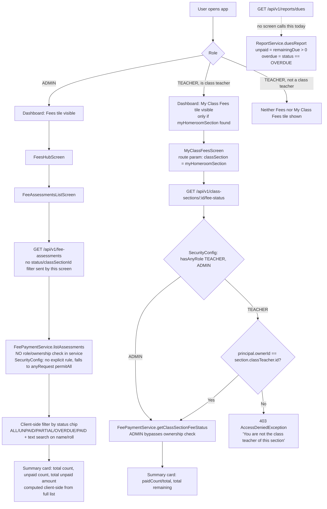

# Fees Overview & My Class Fees — Flow

## Overview
This feature gives two different audiences a read-only view over `StudentFeeAssessment` records: a school-wide "Fee Assessments" list for the principal/admin (with status filter chips and search), and a scoped "My Class Fees" view that a homeroom teacher uses to see dues for only their own section. Both screens render the same underlying `FeeAssessmentResponse` shape (student name, roll number, total/paid/remaining due, status), but they hit different backend endpoints with very different authorization strength. A separate, currently backend-only "dues report" endpoint aggregates unpaid/overdue totals school-wide but has no consuming screen in the app today.

## Actors / roles
- **ADMIN**: Full access — sees every fee assessment in the school via `FeeAssessmentsListScreen`, can query any class-section's fee status, and is the implicit audience for `GET /api/v1/reports/dues` (currently unconsumed by any screen).
- **TEACHER**: Reached via the dashboard's "My Class Fees" tile, which only appears if the teacher is the `classTeacher` of some section (`myHomeroomSection`). The tile navigates straight to `MyClassFeesScreen` for that one section, backed by `GET /api/v1/class-sections/{id}/fee-status`, which is enforced server-side to the teacher's own section. The generic "Fees" hub (and thus `FeeAssessmentsListScreen`) is explicitly hidden from teachers in the UI (`TEACHER_HIDDEN_FEATURES` includes `'fees'`), but the backing endpoint `GET /api/v1/fee-assessments` itself has no role check, so a teacher (or any caller) hitting it directly would see the whole school's assessments, not just their section.
- **STUDENT**: Not part of this feature's screens; students see their own fees via a separate `MyFees` screen (`GET /api/v1/students/{studentId}/fee-assessments`, out of scope here) which enforces only "own assessment" via `assertCanPayOrRecord`/self checks elsewhere, not via this feature's screens.
- **PARENT**: Same student-scoped endpoint as above; `FeePaymentService.listByStudent` requires `parentService.requireLinkedChild(...)` for PARENT callers specifically. Not part of the two screens documented here.

## Flow diagram

## Step-by-step
1. **Admin path**: Admin opens the dashboard, taps the "Fees" tile (visible to ADMIN only — `TEACHER_HIDDEN_FEATURES` hides it from teachers), lands on `FeesHubScreen`, and taps "Fee Assessments" to reach `FeeAssessmentsListScreen`.
2. `FeeAssessmentsListScreen` calls `listFeeAssessments(schoolId)` — no `status` or `classSectionId` query params are actually passed by this screen even though the API client function supports both. This hits `GET /api/v1/fee-assessments`.
3. `FeePaymentController.listAssessments` delegates to `FeePaymentService.listAssessments(status, classSectionId)`, which queries `StudentFeeAssessmentRepository.findAllBySchoolId` (or `findAllBySchoolIdAndStatus` when a status is given), scoped only by `schoolContext.getSchoolId()` — no role or per-teacher filtering happens here at all.
4. The screen re-derives the summary card (total assessments, unpaid count, total unpaid ₹) and status filter chips (`ALL`/`UNPAID`/`PARTIAL`/`OVERDUE`/`PAID`) and free-text search (by student name or roll number) entirely client-side over the full, unfiltered result set returned from step 3.
5. **Teacher path**: A TEACHER's dashboard fetches `listClassSections(schoolId)` and finds the section where `classTeacherId === session.ownerId`, storing it as `myHomeroomSection`. The "My Class Fees" tile only renders `if (isTeacher && myHomeroomSection)`; tapping it navigates to `MyClassFeesScreen` with that section as a route param — the teacher never chooses a section, it is fixed to their homeroom.
6. `MyClassFeesScreen` calls `getClassSectionFeeStatus(schoolId, classSection.id)` → `GET /api/v1/class-sections/{id}/fee-status`.
7. `SecurityConfig` restricts this route to `hasAnyRole("TEACHER", "ADMIN")` at the URL level. Inside `FeePaymentService.getClassSectionFeeStatus`, the section is loaded via `classSectionService.getScopedClassSection(classSectionId)` (school-scoped lookup), then: ADMIN is always allowed; a TEACHER is allowed only if `section.getClassTeacher().getId().equals(principal.getOwnerId())`; any other case throws `AccessDeniedException("You are not the class teacher of this section")`, which surfaces as HTTP 403.
8. The screen renders a summary (fully-paid count / total, total remaining ₹) and a flat list of that section's students' assessments — no status filter chips or search, since the audience is a single small class roster.
9. **Dues report (backend-only today)**: `GET /api/v1/reports/dues` calls `ReportService.duesReport()`, which internally re-uses `FeePaymentService.listAssessments(null, null)` (the same unscoped, school-wide query as step 3), splits it into `unpaidAssessments` (any assessment with `remainingDue > 0`, i.e. UNPAID/PARTIAL/OVERDUE) and `overdueAssessments` (assessments whose stored `status == OVERDUE`), and sums each into `totalUnpaid`/`totalOverdue`. The frontend has an API client function (`getDuesReport`) but no screen currently calls it.

## Backend endpoints involved
- `GET /api/v1/fee-assessments` (controller: `FeePaymentController.listAssessments`, service: `FeePaymentService.listAssessments`) — lists assessments for the current school, optional `status` (enum: UNPAID/PARTIAL/PAID/OVERDUE) and `classSectionId` query params (the latter filtered in-memory in the service, not via a repository query). **Authorization: none.** Not listed among `SecurityConfig`'s explicit `requestMatchers`, so it falls to the trailing `.anyRequest().permitAll()`. No role or ownership check in the service either — confirmed by the service's own comment: "No SecurityConfig role restriction on this endpoint historically (open to any authenticated caller) - that pre-existing gap is out of scope here."
- `GET /api/v1/students/{studentId}/fee-assessments` (controller: `FeePaymentController.listByStudent`, service: `FeePaymentService.listByStudent`) — also falls through to `permitAll` in `SecurityConfig` (no explicit rule). Service-layer check exists only for PARENT callers: `parentService.requireLinkedChild(principal.getOwnerId(), studentId, principal.getSchoolId())`. No check at all for other roles.
- `GET /api/v1/class-sections/{id}/fee-status` (controller: `FeePaymentController.getClassSectionFeeStatus`, service: `FeePaymentService.getClassSectionFeeStatus`) — lists every student's assessment in one section. **Authorization: `SecurityConfig` explicit rule** — `.requestMatchers(HttpMethod.GET, "/api/v1/class-sections/*/fee-status").hasAnyRole("TEACHER", "ADMIN")` — plus a **service-layer ownership check**: `boolean isClassTeacher = principal.getRole() == Role.TEACHER && section.getClassTeacher() != null && section.getClassTeacher().getId().equals(principal.getOwnerId()); if (principal.getRole() != Role.ADMIN && !isClassTeacher) throw new AccessDeniedException(...)`. This is the exact mechanism backing "My Class Fees" — a TEACHER who is not that section's class teacher gets HTTP 403.
- `GET /api/v1/reports/dues` (controller: `ReportController.dues`, service: `ReportService.duesReport`) — also not listed in `SecurityConfig`, falls to `permitAll`. No role check in `ReportService` either; it just re-calls the unscoped `FeePaymentService.listAssessments(null, null)`.

## Frontend screens involved
- `src/screens/principal/FeeAssessmentsListScreen.tsx` — admin-facing, school-wide list with a summary card (total/unpaid count/unpaid ₹), status filter chips, and client-side name/roll search. Calls `listFeeAssessments(schoolId)` with no filters.
- `src/screens/principal/MyClassFeesScreen.tsx` — teacher-facing, fixed to one class-section passed via route params (`route.params.classSection`, always the teacher's own homeroom section from the dashboard). Calls `getClassSectionFeeStatus(schoolId, classSection.id)`. No filters or search; shows a paid-count/total and remaining-₹ summary.
- `src/screens/principal/FeesHubScreen.tsx` — menu screen that routes into `FeeAssessmentsList`, `FeeCategoriesList`, `FeeStructuresList`, `FeePaymentSettings`; only reachable from the dashboard's "Fees" tile, which is hidden from teachers.
- `src/screens/principal/PrincipalDashboardScreen.tsx` — computes `myHomeroomSection` (by matching `classTeacherId === session.ownerId` across `listClassSections`) and gates the "My Class Fees" tile on `isTeacher && !!myHomeroomSection`; gates the "Fees" tile away from teachers via `TEACHER_HIDDEN_FEATURES`.
- `src/api/feeAssessments.ts` — client functions: `listFeeAssessments(schoolId, status?, classSectionId?)`, `listStudentFeeAssessments`, `getClassSectionFeeStatus`, `getDuesReport`, `getPayrollOverview`.

## Data model
- `StudentFeeAssessment` (`com.gurukul.fees.entity.StudentFeeAssessment`): `student` (ManyToOne), `academicYear`, `totalDue` (BigDecimal, precision 12/scale 2), `totalPaid` (default zero), `status` (enum `FeeAssessmentStatus`), `dueDate`. Unique constraint on `(school_id, student_id, academic_year)` — one assessment per student per year.
- `FeeAssessmentStatus`: `UNPAID`, `PARTIAL`, `PAID`, `OVERDUE`.
- `FeeAssessmentResponse` DTO adds a derived `remainingDue = totalDue - totalPaid`, computed fresh on every read (not stored) — plus `studentName`, `rollNumber`, `schoolId`, `studentId`, timestamps.
- `StudentFeeAssessmentRepository` query methods used here: `findAllBySchoolId`, `findAllBySchoolIdAndStatus`, `findAllBySchoolIdAndStudent_ClassSection_Id` (used by `getClassSectionFeeStatus`), `findAllBySchoolIdAndStudentId`.
- `ReportDtos.DuesReport`: `unpaidAssessments` (list), `totalUnpaid`, `overdueAssessments` (list), `totalOverdue` — per the DTO's own `@Schema` doc, `unpaidAssessments` covers "every UNPAID/PARTIAL/OVERDUE assessment (anything with a remaining due)" and `overdueAssessments` is just the OVERDUE subset.

## Known limitations / edge cases
- **`status` is a stored field recomputed only on payment, not a live calculation.** `FeePaymentService.computeStatus(...)` (which flips an assessment to `OVERDUE` once its `dueDate` has passed) is only invoked from `recordPayment(...)`. There is no scheduled job (`@Scheduled`) anywhere in the fees package that re-evaluates status as due dates pass. An assessment created via `FeeStructureService` starts as `UNPAID` (hard-coded) and will silently stay `UNPAID` forever — even long past its due date — until someone makes a payment against it. This means: the `OVERDUE` status filter chip in `FeeAssessmentsListScreen`, the class-teacher's fee-status view, and `reports/dues`'s `overdueAssessments`/`totalOverdue` can all under-report true overdue fees for assessments that have received zero payments. `remainingDue`, by contrast, is always fresh since it's computed at read time from `totalDue - totalPaid`.
- **`GET /api/v1/fee-assessments` has no authorization at all** — not gated by role in `SecurityConfig` (falls to the catch-all `permitAll()`) and no role/ownership check in `FeePaymentService.listAssessments`. The mobile app's UI hides the "Fees" tile from teachers, but that is a UI-only restriction; a teacher (or anyone able to reach the API with a valid, existing school's UUID in `X-School-Id`) can call this endpoint directly and get every student's fee assessment in that school, bypassing the section-scoping that `My Class Fees` otherwise enforces. `GET /api/v1/reports/dues` and `GET /api/v1/students/{id}/fee-assessments` have the same gap (the latter has a PARENT-only ownership check, nothing for other roles).
- **`SchoolContextFilter` does not cross-check `X-School-Id` against the caller's own JWT school.** It only validates that the header is a syntactically valid UUID for a school that exists (`schoolService.requireExists`); combined with the previous point, a caller could in principle target a different school's data by changing the header, though this is a systemic gap outside this feature.
- **`classSectionId` filtering in `listAssessments` is done in-memory** (`.stream().filter(...)`) after fetching all matching assessments for the school, rather than via a repository query — fine at small scale, but means the whole school's rows (or all rows of a given status) are always loaded before filtering; for a large school with many students/years of assessments, both this endpoint and `reports/dues` (which itself calls `listAssessments(null, null)` — the entire un-filtered set) load every assessment row into memory on every call.
- `FeeAssessmentsListScreen`'s `classSectionId` filter parameter is supported by the API client (`listFeeAssessments(schoolId, status?, classSectionId?)`) but the screen itself never passes it — so the "class-scoped" filtering capability of this endpoint is currently unused by any screen except indirectly via the separate `fee-status` endpoint.
- `GET /api/v1/reports/dues` has no consuming screen in the frontend today (`getDuesReport` is defined in `src/api/feeAssessments.ts` but not called anywhere) — it is exercised only by the backend integration test.
- A teacher who is class teacher of more than one section has no way to switch sections in `MyClassFeesScreen` — the dashboard only resolves a single `myHomeroomSection` (`.find(...)`, first match) and always routes to that one section.
