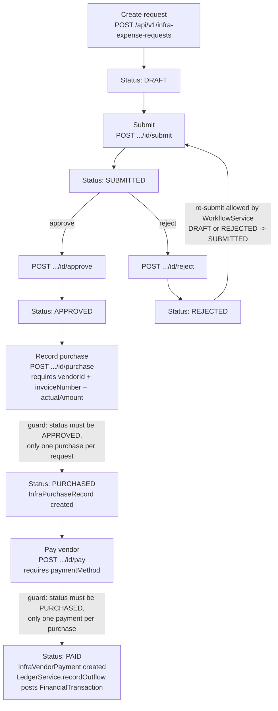

# Infra Expenses (Request/Approve/Purchase/Pay) — Flow

## Overview
Infra Expenses is a four-stage procurement workflow for school infrastructure spend: a request is drafted against a category and estimated amount, submitted for approval, approved or rejected, then (once approved) a purchase is recorded against a vendor with an actual amount and invoice number, and finally the vendor is paid, which posts an outflow to the shared financial ledger. The entity's own `status` field (`InfraExpenseRequest.status`) is the single source of truth the API and UI branch on; a parallel, largely decorative `ApprovalRequest`/`WorkflowService` audit trail is updated alongside it but is not itself consulted by the purchase/pay steps.

## Actors / roles
- **ADMIN**: In code, no role is actually required to call any infra-expense or vendor endpoint (see Known limitations). By intent/UI wiring this is the "principal/admin" workflow: create requests, submit, approve, reject, record purchases, and mark vendor payments.
- **TEACHER**: No backend restriction found; the frontend currently routes any non-PARENT session into `PrincipalNavigator` (see `App.tsx` line 230: `session.ownerType === 'PARENT' ? <ParentNavigator /> : <PrincipalNavigator />`), which contains the Infra Expense screens, so a TEACHER session would technically reach these screens too.
- **STUDENT**: Same as TEACHER — no explicit backend or screen-level exclusion was found.
- **PARENT**: Routed to `ParentNavigator` instead of `PrincipalNavigator`, so PARENT sessions have no navigation path to these screens in the app UI. The backend API itself still has no role check, so a PARENT's authenticated token could call the endpoints directly if it tried.

## Flow diagram

## Step-by-step
1. **Create request** (`createRequest`) — anyone hitting the API creates an `InfraExpenseRequest` with a category, description, and `estimatedAmount`; status starts at `DRAFT`. A companion `ApprovalRequest` row is created via `WorkflowService.getOrCreate` (also `DRAFT`).
2. **Submit** (`submit`) — moves the entity to `SUBMITTED`. `WorkflowService.submit` enforces that the *workflow's own* tracked status is `DRAFT` or `REJECTED` before allowing this, throwing `IllegalArgumentException("Cannot submit request in status: ...")` otherwise. The caller's identity is passed only as a free-text `actor` string (defaults to `"admin"` if omitted) — it is not validated against the caller's real role or user id.
3. **Approve** (`approve`) — moves the entity to `APPROVED`. `WorkflowService.approve` requires the workflow status to be `SUBMITTED` (`"Only submitted requests can be approved"` otherwise) and records an `ApprovalHistory` row. `actor` defaults to `"principal"` if omitted — again a free-text label, not an authenticated role check.
4. **Reject** (`reject`) — moves the entity to `REJECTED` via the same `SUBMITTED`-only guard in `WorkflowService.reject`. A rejected request can be re-submitted (step 2) because `WorkflowService.submit` explicitly allows `DRAFT` or `REJECTED` as the starting state.
5. **Record purchase** (`recordPurchase`) — only allowed when `InfraExpenseRequest.status == APPROVED` (`IllegalArgumentException("Only approved requests can be purchased")` otherwise); also rejects a second purchase for the same request (`"Purchase already recorded"`). Looks up the vendor via `VendorService.getScopedEntity(vendorId)` (school-scoped lookup), stores `invoiceNumber` and `actualAmount` on a new `InfraPurchaseRecord`, and flips the request to `PURCHASED`. Note this check reads `InfraExpenseRequest.status` directly — it does **not** re-consult the `WorkflowService`/`ApprovalRequest` trail.
6. **Pay vendor** (`payVendor`) — only allowed when status is `PURCHASED` (`"Only purchased requests can be paid"`); rejects a second payment against the same purchase (`"Vendor already paid"`). Calls `LedgerService.recordOutflow(SourceType.VENDOR_PAYMENT, purchase.getId(), purchase.getActualAmount(), paymentMethod, paymentReference, transactionDate ?? today, null, "Infra expense: " + description)` to post a `FinancialTransaction`, creates an `InfraVendorPayment` linking to that transaction id, and flips status to `PAID`. The **actual purchase amount** (not the original estimate) is what gets posted to the ledger.

## Backend endpoints involved
- `GET /api/v1/infra-expense-categories` (controller: `InfraExpenseController.listCategories`) — lists categories for the current school. No role restriction in `SecurityConfig`; falls through to the trailing `anyRequest().permitAll()`.
- `GET /api/v1/infra-expense-requests` (controller: `InfraExpenseController.listRequests`) — lists all requests for the school. No role restriction (`permitAll()` fallthrough).
- `POST /api/v1/infra-expense-requests` (controller: `InfraExpenseController.create`) — creates a `DRAFT` request. No role restriction.
- `POST /api/v1/infra-expense-requests/{id}/submit` (controller: `InfraExpenseController.submit`) — `DRAFT`/`REJECTED` → `SUBMITTED`. No role restriction.
- `POST /api/v1/infra-expense-requests/{id}/approve` (controller: `InfraExpenseController.approve`) — `SUBMITTED` → `APPROVED`. No role restriction.
- `POST /api/v1/infra-expense-requests/{id}/reject` (controller: `InfraExpenseController.reject`) — `SUBMITTED` → `REJECTED`. No role restriction.
- `POST /api/v1/infra-expense-requests/{id}/purchase` (controller: `InfraExpenseController.purchase`) — `APPROVED` → `PURCHASED`, requires vendor + invoice + actual amount. No role restriction.
- `POST /api/v1/infra-expense-requests/{id}/pay` (controller: `InfraExpenseController.pay`) — `PURCHASED` → `PAID`, posts a ledger outflow. No role restriction.
- `GET /api/v1/vendors`, `GET /api/v1/vendors/{id}`, `POST /api/v1/vendors`, `PUT /api/v1/vendors/{id}` (controller: `VendorController`) — vendor master data used to populate `VendorPicker` for the purchase step. No role restriction in `SecurityConfig`.

Checked exhaustively: `D:\Gurukul\Gurukul_bk\src\main\java\com\gurukul\config\SecurityConfig.java` contains no `requestMatchers` entry for `/api/v1/infra-expense-*` or `/api/v1/vendors*` — these paths are covered only by the final line `.anyRequest().permitAll()`. There is also no `@PreAuthorize`, `Role.` check, or `AuthPrincipal` reference anywhere under `com.gurukul.expenses` or in `VendorController`/`VendorService`. The only "actor" concept is the free-text `actor`/`comment` fields on `InfraExpenseDtos.ApprovalActionRequest`, which are stored for audit purposes but never checked against the authenticated user's actual role.

## Frontend screens involved
- `InfraExpensesListScreen.tsx` (`src/screens/principal/InfraExpensesListScreen.tsx`) — lists all requests for the school with category, estimated amount, and a `StatusChip`; has a "+ New request" button to `InfraExpenseForm`.
- `InfraExpenseFormScreen.tsx` (`src/screens/principal/InfraExpenseFormScreen.tsx`) — the "create request" form: category picker (`InfraCategoryPicker`), description, estimated amount; calls `createInfraExpenseRequest` then navigates to `InfraExpenseDetail`.
- `InfraExpenseDetailScreen.tsx` (`src/screens/principal/InfraExpenseDetailScreen.tsx`) — shows category/estimated amount and three always-visible action buttons regardless of current status: "Submit / Approve / Reject" (opens a panel with all three actions plus optional actor/comment fields), "Record purchase" (vendor picker via `VendorPicker`, invoice number, actual amount), and "Mark as paid" (payment method as free-text input, optional reference, transaction date). **The UI does not hide/disable actions based on the request's current status** — e.g. the "Record purchase" and "Mark as paid" buttons are always rendered even on a `DRAFT` request; invalid transitions are only caught by the backend's `IllegalArgumentException` guards and surfaced as an inline error string.
- `VendorsListScreen.tsx` / `VendorDetailScreen.tsx` / `VendorFormScreen.tsx` (`src/screens/principal/`) — vendor master-data CRUD (list, view, create/edit) that the purchase step's `VendorPicker` draws from.
- Wired in `src/navigation/PrincipalNavigator.tsx` (routes `InfraExpensesList`, `InfraExpenseDetail`, `InfraExpenseForm`, plus `VendorsList`/`VendorDetail`/`VendorForm`). `PrincipalNavigator` is rendered for every session whose `ownerType !== 'PARENT'` (`App.tsx` line 230), i.e. it is not exclusively an ADMIN/principal surface at the navigation-gating level.
- API client: `src/api/infraExpenseRequests.ts` (list/create/submit/approve/reject/purchase/pay) and `src/api/vendors.ts` (list/get/create/update), both calling the paths above with the `X-School-Id` header via `src/api/client.ts`.

## Data model
- `InfraExpenseCategory` (`infra_expense_category`): `code`, `name`, unique per `(school_id, code)`.
- `InfraExpenseRequest` (`infra_expense_request`): `category` (FK, required), `description`, `estimatedAmount` (BigDecimal 12,2), `status` (`InfraExpenseStatus` enum, stored as string).
- `InfraExpenseStatus` enum values, in lifecycle order: `DRAFT`, `SUBMITTED`, `APPROVED`, `REJECTED`, `PURCHASED`, `PAID`.
- `InfraPurchaseRecord` (`infra_purchase_record`): FK `request` (required, one purchase per request enforced in service via `purchaseRepository.findByRequestId`), FK **`vendor`** → `com.gurukul.vendors.entity.Vendor` (required — this is the vendor link), `invoiceNumber`, `actualAmount` (12,2).
- `Vendor` (`com.gurukul.vendors.entity.Vendor`, table `vendor`): `name` (required), `contactPhone`, `contactEmail`, `bankAccount`, `upiId`, `address`. Vendors are school-scoped master data managed independently via `VendorController`/`VendorsListScreen`/`VendorFormScreen`, and the purchase step's `VendorPicker` picks an existing vendor by id (`VendorService.getScopedEntity(vendorId)`).
- `InfraVendorPayment` (`infra_vendor_payment`): FK `purchase` (required, one payment per purchase enforced via `vendorPaymentRepository.findByPurchaseId`), `transactionId` (UUID, points at the `FinancialTransaction` created by `LedgerService.recordOutflow` with `SourceType.VENDOR_PAYMENT`).
- Parallel audit trail: `ApprovalRequest`/`ApprovalHistory` (`com.gurukul.workflow`) keyed by `(entityType="INFRA_EXPENSE", entityId=requestId)`, tracking its own `ApprovalStatus` (`DRAFT`/`SUBMITTED`/`APPROVED`/`REJECTED`) plus `submittedBy`/`approvedBy`/`comment` — this is written on submit/approve/reject but is not read by `recordPurchase`/`payVendor`, and has no `PURCHASED`/`PAID` states of its own.

## Known limitations / edge cases
- **No authorization enforcement anywhere in this feature.** `SecurityConfig.java` has zero `requestMatchers` entries for `/api/v1/infra-expense-*` or `/api/v1/vendors*`; both fall through to `.anyRequest().permitAll()`. `InfraExpenseService` and `VendorService` contain no `Role.*`, `@PreAuthorize`, or `AuthPrincipal` checks. Any authenticated (or per `permitAll()`, arguably any) caller with a valid `X-School-Id` can create, approve, reject, record a purchase for, or pay any expense request in that school — this is a real gap for a money-moving workflow.
- **"Actor" is unauthenticated free text.** `submit`/`approve`/`reject` accept an optional `actor` string defaulting to the literal `"admin"` or `"principal"` — it is never cross-checked against the caller's real identity or role, so the approval audit trail (`ApprovalHistory.changedBy`) cannot be trusted as evidence of who actually approved something.
- **Two independent status trackers can drift.** `InfraExpenseRequest.status` (consulted by `recordPurchase`/`payVendor`) and the `ApprovalRequest`/`WorkflowService` status (consulted by `submit`/`approve`/`reject`) are updated in the same transaction today, but nothing enforces they stay consistent — a bug or partial failure could leave them out of sync, and `WorkflowService` has no `PURCHASED`/`PAID` states at all so it stops modeling the process after approval.
- **No edit or cancel path.** There is no endpoint to edit a request's description/amount, or to cancel/withdraw a `DRAFT` or `SUBMITTED` request. The only way out of `REJECTED` is re-submitting the same request (allowed by `WorkflowService.submit`'s `DRAFT || REJECTED` check), which re-uses the original estimate — there's no revision history of estimate changes.
- **No budget-vs-actual tracking or reporting.** `estimatedAmount` (at request time) and `actualAmount` (at purchase time) are both stored but the code never compares them, aggregates variance, or exposes a report; the UI simply displays each amount separately.
- **Rejection cannot be reversed by a stray approve** — `WorkflowService.approve`/`.reject` both require the workflow status to be `SUBMITTED`, so trying to approve a `REJECTED` request fails with an `IllegalArgumentException` until it is re-submitted. This is enforced correctly, but the frontend's "Submit / Approve / Reject" panel shows all three buttons at once regardless of current status, so a user can trigger an invalid transition and only learn about it from the resulting error string.
- **No frontend status-based gating.** `InfraExpenseDetailScreen.tsx` always renders "Record purchase" and "Mark as paid" buttons, even for a `DRAFT` request; every transition guard lives purely in the backend service layer, and the UI's only feedback is the caught `Error.message` from the API call.
- **Payment method is free text in the UI** (`LabeledInput label="Payment method" placeholder="CASH / UPI / BANK_TRANSFER"`) even though the backend DTO requires a real `PaymentMethod` enum value (`@NotNull private PaymentMethod paymentMethod`) — an invalid string will fail backend validation with no client-side enum picker to prevent it.
- **Vendor payment reconciliation is one-way**: `InfraVendorPayment` stores the `FinancialTransaction` id it created, but there is no endpoint shown here to look up or reverse that transaction from the infra-expense side (e.g. no refund/void flow) if a payment needs correction.
