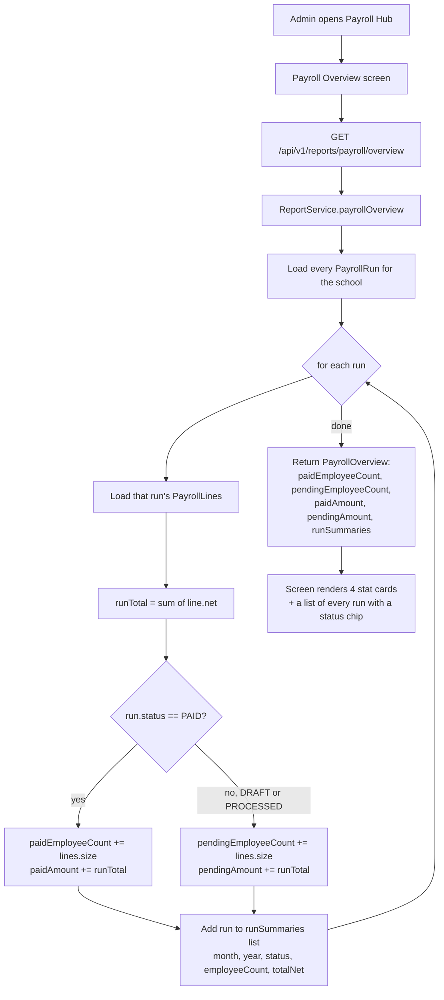

# Payroll Overview — Flow

## Overview
Payroll Overview is a single read-only dashboard (`GET /api/v1/reports/payroll/overview`) that rolls up every payroll run in the school into two numbers on each side of a paid/pending split: how many employees and how much money. Verified directly in `ReportService.payrollOverview()`: the split is computed **per payroll run**, not per employee — a run's own `PayrollRunStatus` (`DRAFT`/`PROCESSED`/`PAID`) is the only thing that decides whether every employee in that run counts as "paid" or "pending" in this report, even though payment is actually recorded per employee (a `SalaryPayment` row per `PayrollLine`) underneath.

## Actors / roles
- **ADMIN**: The only role with a screen for this (`PayrollOverviewScreen`, reached from `PayrollHubScreen`, both under `PrincipalNavigator`).
- **TEACHER**: No screen; no role check in `ReportService`/`ReportController` either.
- **STUDENT**: Not involved.
- **PARENT**: Not involved.

## Flow diagram

## Step-by-step
1. Admin opens **Payroll Hub** → **Payroll Overview**. The screen immediately calls `getPayrollOverview(schoolId)` → `GET /api/v1/reports/payroll/overview`, with no filters or parameters.
2. `ReportController.payrollOverview()` delegates to `ReportService.payrollOverview()`, which loads every `PayrollRun` for the current school (`payrollRunRepository.findAllBySchoolId`) — every run ever created, regardless of month/year or how old it is.
3. For each run, it loads that run's `PayrollLine`s and sums their `net` values into `runTotal`.
4. If `run.getStatus() == PayrollRunStatus.PAID`, every line in that run is added to `paidEmployeeCount` and `runTotal` is added to `paidAmount`. Otherwise (the run is `DRAFT` or `PROCESSED`), every line is added to `pendingEmployeeCount` and `runTotal` is added to `pendingAmount`. This is a run-level branch — it never inspects whether an individual `PayrollLine` has its own `SalaryPayment` row.
5. Each run also contributes one `RunSummary` entry (`month`, `year`, `status` as a string, the line count as `employeeCount`, and `runTotal` as `totalNet`) to a list returned alongside the two counts and two totals.
6. The screen renders four stat cards (paid count, pending count, paid ₹, pending ₹) and a list of every run with a month/year label, employee count, total ₹, and a status chip (green "PAID" vs. amber for anything else).

## Backend endpoints involved
- `GET /api/v1/reports/payroll/overview` (controller: `ReportController.payrollOverview`, service: `ReportService.payrollOverview`) — returns the paid/pending rollup described above. **Authorization**: `SecurityConfig.java` has no `requestMatchers` entry for `/api/v1/reports/payroll/overview` or `/api/v1/reports/**` generally; it falls through to the trailing `.anyRequest().permitAll()`. `ReportService.payrollOverview()` performs no role or ownership check — any caller with a valid `X-School-Id` header can call it.
- `GET /api/v1/reports/payroll/{year}` (controller: `ReportController.payrollYear`, service: `ReportService.payrollYearReport`) — a related but separate yearly-totals report, not consumed by `PayrollOverviewScreen` and not otherwise covered here.

## Frontend screens involved
- `PayrollOverviewScreen.tsx` — calls `getPayrollOverview(schoolId)` once on mount; renders paid/pending employee counts and ₹ totals as stat cards, then every run in `overview.runs` as a row with a status chip (`variant="success"` only when `run.status === 'PAID'`, `"warning"` otherwise — so `DRAFT` and `PROCESSED` are visually indistinguishable from each other on this screen, both just "not paid yet").

## Data model
- `ReportDtos.PayrollOverview`: `paidEmployeeCount` (long), `pendingEmployeeCount` (long), `paidAmount` (BigDecimal), `pendingAmount` (BigDecimal), `runs` (`List<RunSummary>`).
- `ReportDtos.PayrollOverview.RunSummary`: `month`, `year`, `status` (the run's `PayrollRunStatus` as a string), `employeeCount` (that run's line count), `totalNet` (sum of that run's lines' `net`).
- Reads from `PayrollRun` (`status`: `DRAFT`/`PROCESSED`/`PAID`) and `PayrollLine` (`net`) — **there is no per-line/per-employee "paid" flag anywhere in the schema.** The only record that a specific employee within a run was paid is a `SalaryPayment` row (one per `PayrollLine`, created during the `/pay` action), and `payrollOverview()` does not query `SalaryPaymentRepository` at all.

## Known limitations / edge cases
- **Confirmed: paid/pending status is tracked per run, not per employee, in this report.** `PayrollRunStatus` has exactly three values (`DRAFT`, `PROCESSED`, `PAID`) and lives only on `PayrollRun`; `PayrollLine` has no boolean/status field of its own. `payrollOverview()`'s branch is literally `boolean paid = run.getStatus() == PayrollRunStatus.PAID` applied once per run, then every line in that run is bucketed the same way. In practice this is consistent with how `payRun()` actually works (it pays every unpaid line in the run in one call and then unconditionally marks the whole run `PAID`), so today there is no scenario where a run is partially paid — but the overview's aggregation would not be able to represent that even if one existed, because it never looks at the underlying `SalaryPayment` rows it could use to compute a true per-employee figure.
- **No authorization on this endpoint** — falls through to `permitAll()` with no service-level role check, same gap as the rest of the payroll and fees reporting endpoints.
- **Every run ever created is included, with no date range or pagination.** `findAllBySchoolId` has no year/month filter, so a school with several years of payroll history gets every run — and every run's lines re-fetched and re-summed — on every single call to this one endpoint.
- **`DRAFT` and `PROCESSED` runs are both counted as "pending"** with no way to distinguish "not started" from "calculated but not yet paid" in the aggregate counts — that distinction is only visible in the per-run `status` string in the `runs` list, not in the two headline counts.
- **No drill-down from a run row to its individual employees/lines** on this screen — `PayrollRunScreen` (a different screen, reached separately) is where lines for a specific run are visible.
