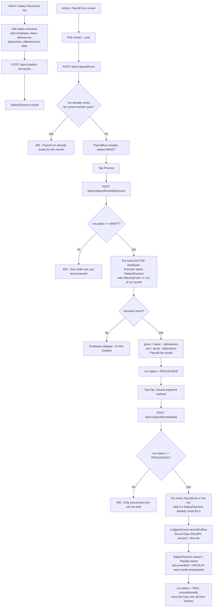

# Payroll — Salary Structures & Runs — Flow

## Overview
Every employee has a `SalaryStructure` (basic + allowances + deductions, versioned by an `effectiveFrom` date). A school runs payroll for one calendar month at a time via a `PayrollRun`, which moves through three states: `DRAFT` (created, nothing calculated) → `PROCESSED` (a `PayrollLine` computed for every active employee from their currently-effective salary structure) → `PAID` (money recorded against every line via the shared finance ledger, plus a `Payslip` document reference issued per line). There is no statutory payroll compliance (PF/ESI/professional tax/TDS) computed anywhere in this flow — see Known limitations.

## Actors / roles
- **ADMIN**: The only role with screens for this feature (`PayrollHubScreen` and everything under it, wired into `PrincipalNavigator`). Creates salary structures, creates/processes/pays payroll runs, and can view any employee's payslip/salary history (`SalaryHistoryScreen`, reached from an employee's detail screen).
- **TEACHER**: No screens for this feature. Nothing in `PayrollController`/`PayrollService` checks for or references a TEACHER role either.
- **STUDENT**: Not involved; no screens, no service-layer references.
- **PARENT**: Not involved; no screens, no service-layer references.

## Flow diagram

## Step-by-step
1. Admin opens **Payroll Hub** → **Salary Structures**, taps "Add", picks an employee, and enters `basic` (required, `> 0`), `allowances` and `deductions` (optional, default 0), and an `effectiveFrom` date. `POST /api/v1/salary-structures` saves it — there is no uniqueness check, so an employee can have multiple structures; the most recent one whose `effectiveFrom` is on or before the 1st of the run's month is the one used.
2. Admin opens **Payroll Hub** → **Run Payroll**, picks a month and year, and creates the run (`POST /api/v1/payroll/runs`). The server rejects a duplicate run for the same `(school, month, year)` with `IllegalArgumentException("Payroll run already exists for this month")`. The new run starts as `DRAFT`.
3. Admin taps "Process". `POST /api/v1/payroll/runs/{id}/process` requires the run to be `DRAFT` (`"Only draft runs can be processed"` otherwise). The service loads every `Employee` with `status == ACTIVE` for the school, and for each one finds their salary structures ordered by `effectiveFrom` descending, taking the first one whose `effectiveFrom` is not after the first day of the run's month. If none qualifies (e.g. the employee was hired after that month, or has no structure at all), that employee is silently skipped — no line, no error. For every employee that does qualify: `gross = basic + allowances`, `net = gross - deductions`, and a `PayrollLine` is saved recording `gross`, `deductions`, and `net`. The run flips to `PROCESSED`.
4. The screen lists the resulting `PayrollLine`s (employee name + net pay); tapping one opens `PayslipDetailScreen`, which calls `GET /api/v1/payroll/lines/{id}/payslip` — this only succeeds once the run has also been paid (a `Payslip` row is only created at the pay step).
5. Admin fills in a payment method (`CASH`/`UPI`/`BANK_TRANSFER`/`CHEQUE`/`CARD`, required), an optional reference, and a transaction date, then taps "Pay". `POST /api/v1/payroll/runs/{id}/pay` requires the run to be `PROCESSED` (`"Only processed runs can be paid"` otherwise). For every `PayrollLine` in the run, if a `SalaryPayment` already exists for that line it's skipped (idempotency guard); otherwise `LedgerService.recordOutflow(SourceType.SALARY, line.net, ...)` posts a `FinancialTransaction`, a `SalaryPayment` row is saved linking the line to that transaction, and a `Payslip` row is saved with `documentRef = "PAYSLIP-{year}-{month}-{employeeId}"`. After the loop finishes — regardless of how many lines existed or were skipped — the run is unconditionally set to `PAID`.
6. Admin can also open an employee's **Salary History** (from the employee's own detail screen) to see every `PayrollLine` ever generated for them across runs, each tagged with that run's status (`GET /api/v1/employees/{id}/salary-history`).

## Backend endpoints involved
- `GET /api/v1/salary-structures` (`PayrollController.listStructures` → `PayrollService.listSalaryStructures`) — lists all salary structures in the school.
- `POST /api/v1/salary-structures` (`PayrollController.createStructure` → `PayrollService.createSalaryStructure`) — creates a structure for an employee.
- `POST /api/v1/payroll/runs` (`PayrollController.createRun` → `PayrollService.createRun`) — creates a `DRAFT` run for a month/year, rejecting duplicates.
- `POST /api/v1/payroll/runs/{id}/process` (`PayrollController.processRun` → `PayrollService.processRun`) — `DRAFT` → `PROCESSED`, computes one `PayrollLine` per qualifying active employee.
- `POST /api/v1/payroll/runs/{id}/pay` (`PayrollController.payRun` → `PayrollService.payRun`) — `PROCESSED` → `PAID`, posts a ledger outflow and a `SalaryPayment`/`Payslip` per line.
- `GET /api/v1/payroll/runs/{id}/lines` (`PayrollController.listLines` → `PayrollService.listRunLines`) — lists the lines for a run.
- `GET /api/v1/employees/{id}/salary-history` (`PayrollController.salaryHistory` → `PayrollService.salaryHistory`) — every payroll line ever generated for one employee, across all runs.
- `GET /api/v1/payroll/lines/{id}/payslip` (`PayrollController.getPayslip` → `PayrollService.getPayslip`) — the payslip document reference for one line (only exists once that line's run has been paid).
- **Authorization**: `SecurityConfig.java` contains no `requestMatchers` entry for `/api/v1/salary-structures/**`, `/api/v1/payroll/**`, or `/api/v1/employees/*/salary-history` — all of these fall through to the trailing `.anyRequest().permitAll()`. `PayrollService` has no `@PreAuthorize`, `Role.*` check, or `AuthPrincipal` reference anywhere. Any caller with a valid `X-School-Id` header can create salary structures, create/process/pay payroll runs, and read any employee's salary history for that school — there is no role or ownership restriction of any kind on this feature server-side; it is reachable only via the app's navigation being ADMIN-oriented.

## Frontend screens involved
- `PayrollHubScreen.tsx` — menu linking to Salary Structures, Run Payroll, and Payroll Overview.
- `SalaryStructuresListScreen.tsx` — lists all structures with a computed net (`basic + allowances - deductions`) per row; links to the create form.
- `SalaryStructureFormScreen.tsx` — create form: employee picker, basic (required, positive), allowances/deductions (optional, non-negative), effective-from date.
- `PayrollRunScreen.tsx` — single-screen run lifecycle: pick month/year → create → process (shows resulting lines) → pick payment method/reference/date → pay. No screen exists to browse *past* runs; each visit starts a new run via month/year selection.
- `PayslipDetailScreen.tsx` — shows one employee's gross/deductions (from the `PayrollLine`) and net/document reference (from the `Payslip`, i.e. only populated after the run is paid).
- `SalaryHistoryScreen.tsx` — an employee's full payroll-line history across runs, each row tagged with that run's status.

## Data model
- `SalaryStructure`: `employee` (FK), `basic`, `allowances` (default 0), `deductions` (default 0), `effectiveFrom`. No uniqueness constraint — multiple structures per employee are allowed and the most recent effective one wins per run.
- `PayrollRun`: `month` (int), `year` (int), `status` (`PayrollRunStatus`: `DRAFT`, `PROCESSED`, `PAID`). Unique on `(school_id, month, year)`.
- `PayrollLine`: `run` (FK), `employee` (FK), `gross`, `deductions`, `net` — **only these three amount fields exist; there is no PF, ESI, professional-tax, or TDS field anywhere on this entity.** Unique on `(run_id, employee_id)`.
- `SalaryPayment`: `payrollLine` (FK, one row per line once paid), `transactionId` (points at the `FinancialTransaction` created by `LedgerService.recordOutflow` with `SourceType.SALARY`).
- `Payslip`: `payrollLine` (FK), `documentRef` (a generated string, not a rendered PDF/document).

## Known limitations / edge cases
- **No statutory payroll compliance is computed anywhere.** `PayrollLine` has exactly three amount fields — `gross`, `deductions`, `net` — and `PayrollService.processRun` computes them as `gross = basic + allowances` and `net = gross - deductions`, where `deductions` is a single manually-entered `BigDecimal` on `SalaryStructure`. There is no provident fund (PF), ESI, professional tax, or TDS (income-tax withholding) field, calculation, slab, or rate anywhere in the payroll package. A school subject to any of these must compute them externally and fold the total into the one `deductions` number on each employee's salary structure — this app does not track the components of that number or generate any statutory filing/report from it.
- **No authorization on any endpoint in this feature** (see above) — createable/processable/payable by anyone who can reach the API with a valid `X-School-Id`, not just admins.
- **A run is paid all-at-once, not per employee.** `payRun` iterates every line in the run in a single call; the only per-line state is whether a `SalaryPayment` already exists (an idempotency guard against double-paying the same line if `payRun` were somehow invoked twice), not a deliberate "pay these employees now, the rest later" feature. The run's own `status` always ends as `PAID` after that single call completes, regardless of whether every line actually got a fresh payment or some were pre-existing/skipped.
- **Which salary structure applies is picked automatically and silently.** If an employee has no salary structure effective by the run's month, they are simply omitted from that run's lines — there is no warning, error, or explicit list of "employees excluded from this run" shown anywhere in the UI.
- **A processed run's lines cannot be edited or recalculated.** There is no endpoint to re-process a run (e.g. after fixing a salary structure) — the guard `status != DRAFT` on `processRun` means once processed, its lines are frozen short of a direct database change.
- **No screen lists past payroll runs directly** (only the Payroll Overview's per-run rollup, or starting a new run by re-entering the same month/year, which would fail with "already exists"); `PayrollRunScreen` only shows the run currently being worked on in that screen session.
- **`GET /api/v1/reports/payroll/{year}` exists as a separate yearly-totals report** (`ReportController.payrollYear` → `ReportService.payrollYearReport`) but has no dedicated screen documented here — it is a related but separate reporting endpoint from the run lifecycle above.
